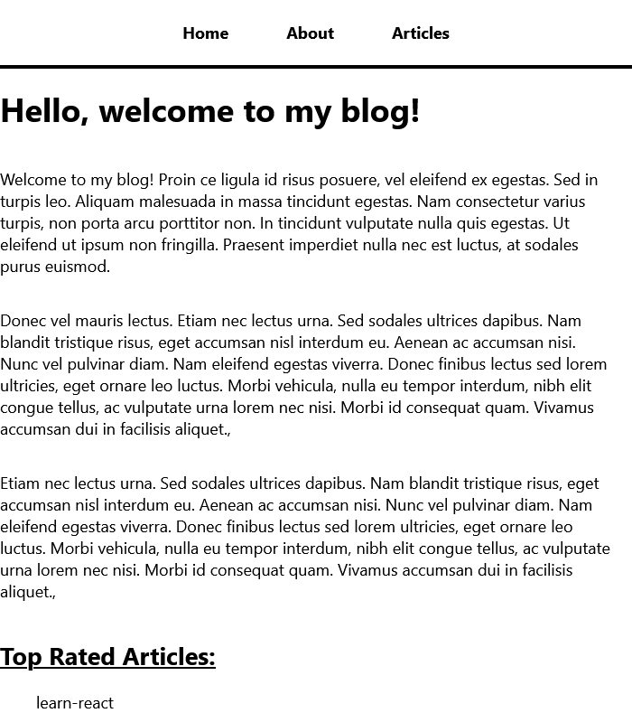

# React Blog

## Frontend Web Application

## Frontend

Click [here](https://github.com/D-Whipp/react-full-stack-site-backend) to view the Backend's repository.

## What I added

- Dislike button
- Delete button (does not delete from mongo db YET)

## LinkedIn Learning Course

- Taught by [Shaun Wassell](https://www.linkedin.com/learning/instructors/shaun-wassell)
- The course: [React: Creating and Hosting a Full-Stack Site](https://www.linkedin.com/learning/react-creating-and-hosting-a-full-stack-site-15153869/create-a-full-stack-website?autoplay=true&resume=false)

## Technologies Used

- HTML
- CSS
- JavaScript
- React.js
- MongoDB
- Firebase
- Axios

## About

Hello, my name is David. 
You can email me at dwhipp88@gmail.com. 
You can view my [github](https://github.com/D-Whipp).  
Check out my [portfolio](http://mighty-brook-32674.herokuapp.com/).
